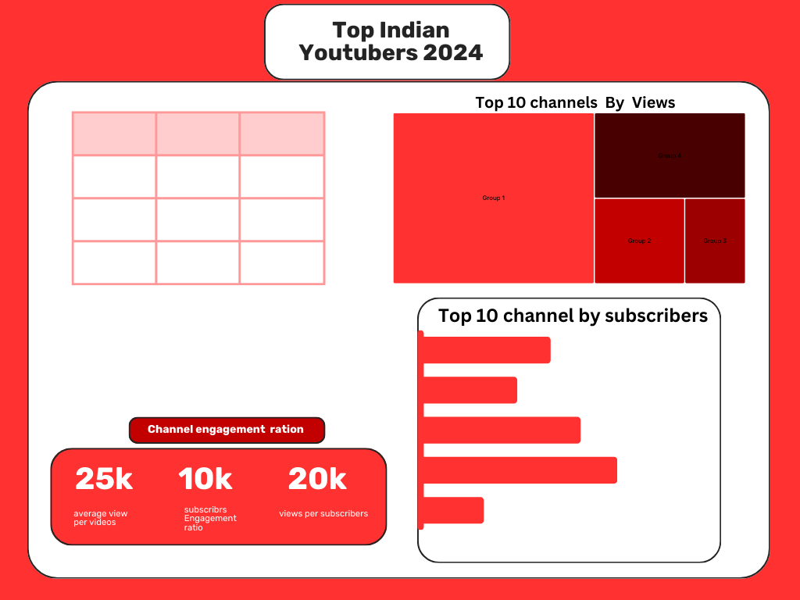
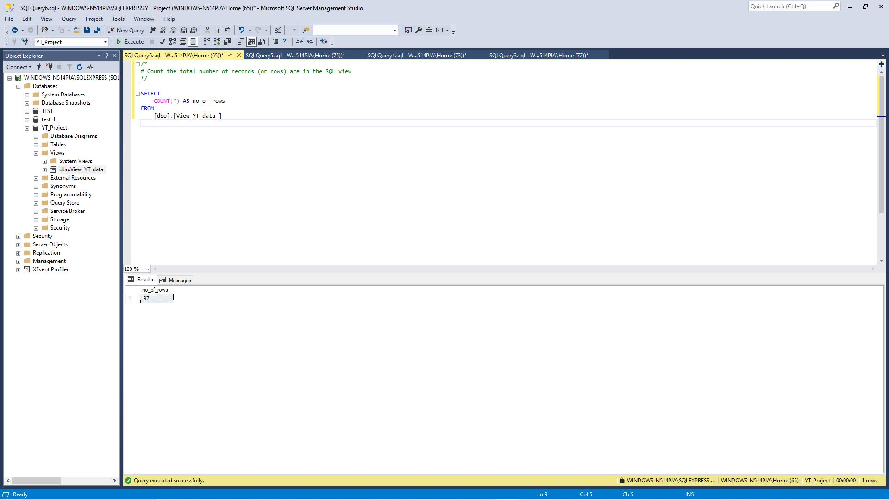
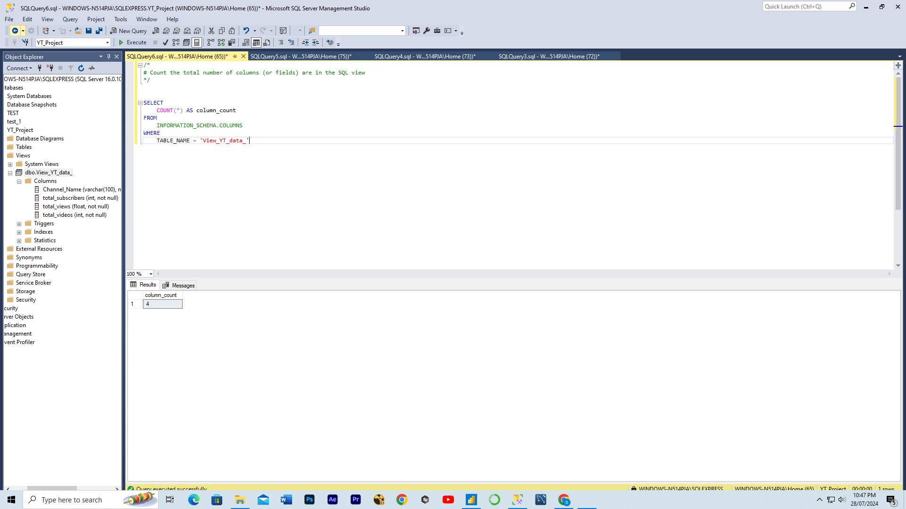
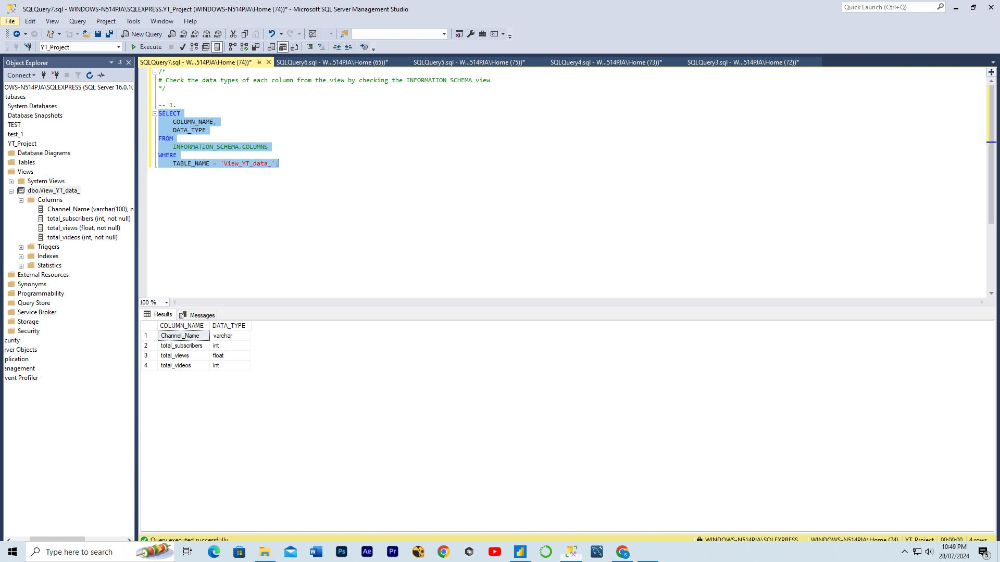
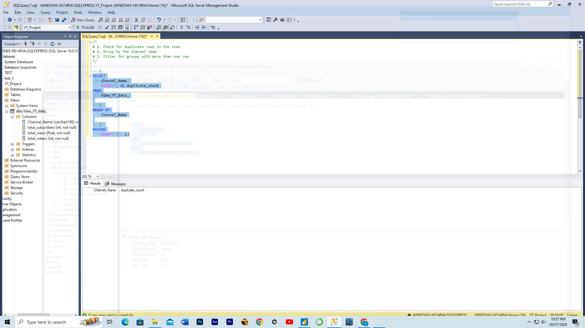
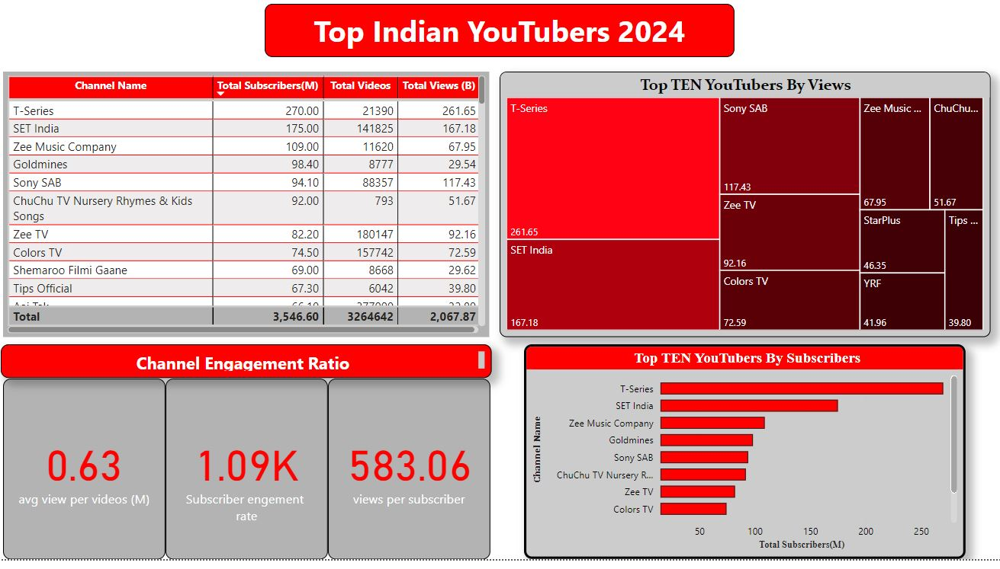
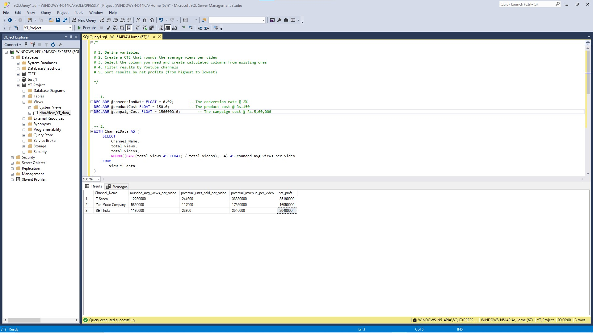
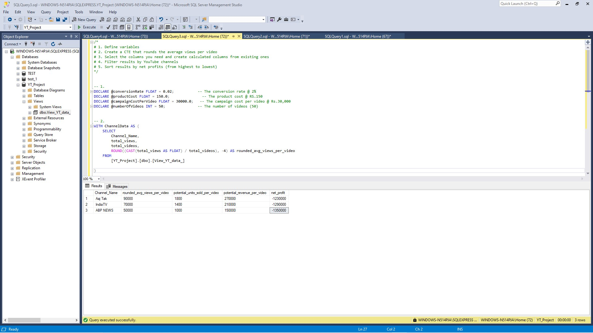
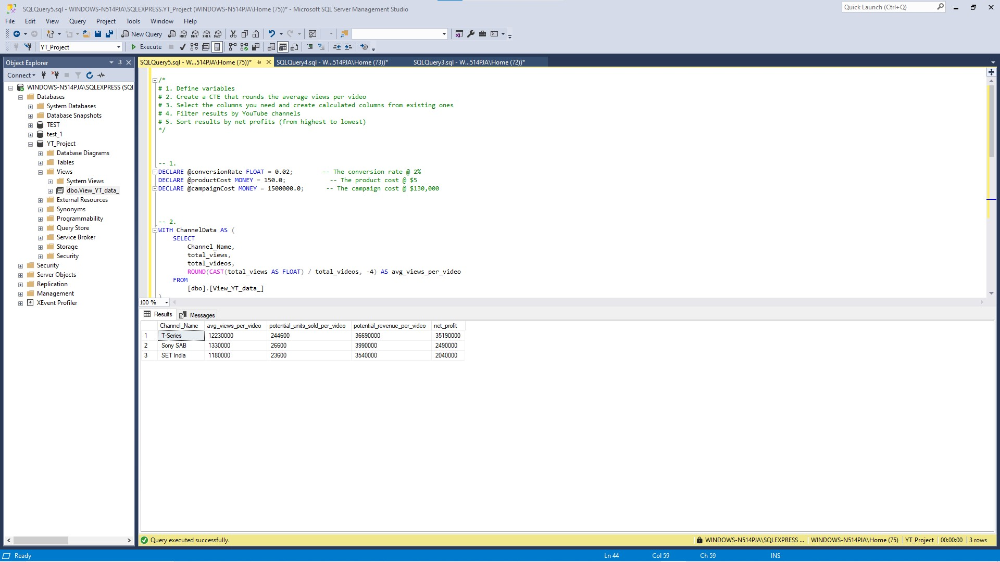

# Data Portfolio: Excel to Power BI 


# Table of contents 

- [Objective](#objective)
- [Data Source](#data-source)
- [Stages](#stages)
- [Design](#design)
  - [Mockup](#mockup)
  - [Tools](#tools)
- [Development](#development)
  - [Pseudocode](#pseudocode)
  - [Data Exploration](#data-exploration)
  - [Data Cleaning](#data-cleaning)
  - [Transform the Data](#transform-the-data)
  - [Create the SQL View](#create-the-sql-view)
- [Testing](#testing)
  - [Data Quality Tests](#data-quality-tests)
- [Visualization](#visualization)
  - [Results](#results)
  - [DAX Measures](#dax-measures)
- [Analysis](#analysis)
  - [Findings](#findings)
  - [Validation](#validation)
  - [Discovery](#discovery)
- [Recommendations](#recommendations)
  - [Potential ROI](#potential-roi)
  - [Potential Courses of Actions](#potential-courses-of-actions)
- [Conclusion](#conclusion)


# Objective 

- What is the key pain point? 

The Head of Marketing wants to find out who the top YouTubers are in 2024 to decide on which YouTubers would be best to run marketing campaigns throughout the rest of the year.


- What is the ideal solution? 

To create a dashboard that provides insights into the top Indian YouTubers in 2024 that includes their 
- subscriber count
- total views
- total videos, and
- engagement metrics

This will help the marketing team make informed decisions about which YouTubers to collaborate with for their marketing campaigns.

## User story 

As the Head of Marketing, I want to use a dashboard that analyses YouTube channel data in the India . 

This dashboard should allow me to identify the top performing channels based on metrics like subscriber base and average views. 

With this information, I can make more informed decisions about which Youtubers are right to collaborate with, and therefore maximize how effective each marketing campaign is.


# Data source 

- What data is needed to achieve our objective?

We need data on the top Indian YouTubers in 2024 that includes their 
- channel names
- total subscribers
- total views
- total videos uploaded


- Where is the data coming from? 
The data is sourced from Kaggle (an Excel extract), [see here to find it.](https://www.kaggle.com/datasets/bhavyadhingra00020/top-100-social-media-influencers-2024-countrywise?resource=download)


# Stages

- Design
- Developement
- Testing
- Analysis 
 


# Design 

## Dashboard components required 
- What should the dashboard contain based on the requirements provided?

To understand what it should contain, we need to figure out what questions we need the dashboard to answer:

1. Who are the top 10 YouTubers with the most subscribers?
2. Which 3 channels have uploaded the most videos?
3. Which 3 channels have the most views?
4. Which 3 channels have the highest average views per video?
5. Which 3 channels have the highest views per subscriber ratio?
6. Which 3 channels have the highest subscriber engagement rate per video uploaded?

For now, these are some of the questions we need to answer, this may change as we progress down our analysis. 


## Dashboard mockup

- What should it look like? 

Some of the data visuals that may be appropriate in answering our questions include:

1. Table
2. Treemap
3. Scorecards
4. Horizontal bar chart 





## Tools 


| Tool | Purpose |
| --- | --- |
| Excel | Exploring the data |
| SQL Server | Cleaning, testing, and analyzing the data |
| Power BI | Visualizing the data via interactive dashboards |
| GitHub | Hosting the project documentation and version control |
| Canva | Designing the mockup of the dashboard | 


# Development

- What's the general approach in creating this solution from start to finish?

1. Get the data from Youtube by using Python API Key
2. Explore the data in Excel
3. Load the data into SQL Server
4. Clean the data with SQL
5. Test the data with SQL
6. Visualize the data in Power BI
7. Generate the findings based on the insights
8. Write the documentation + commentary
9. Publish the data to GitHub Pages

## Data exploration notes

This is the stage where you have a scan of what's in the data, errors, inconcsistencies, bugs, weird and corrupted characters etc  


- What are your initial observations with this dataset? What's caught your attention so far? 

1. There are at least 4 columns that contain the data we need for this analysis, which signals we have everything we need from the file without needing to contact the client for any more data. 
2. The first column contains the channel ID with what appears to be channel IDS, which are separated by a @ symbol - we need to extract the channel names from this.
3. Some of the cells and header names are in a different language - we need to confirm if these columns are needed, and if so, we need to address them.
4. We have more data than we need, so some of these columns would need to be removed


## Data cleaning 
- What do we expect the clean data to look like? (What should it contain? What contraints should we apply to it?)

The aim is to refine our dataset to ensure it is structured and ready for analysis. 

The cleaned data should meet the following criteria and constraints:

- Only relevant columns should be retained.
- All data types should be appropriate for the contents of each column.
- No column should contain null values, indicating complete data for all records.

Below is a table outlining the constraints on our cleaned dataset:

| Property | Description |
| --- | --- |
| Number of Rows | 97 |
| Number of Columns | 4 |

And here is a tabular representation of the expected schema for the clean data:

| Column Name | Data Type | Nullable |
| --- | --- | --- |
| channel_name | VARCHAR | NO |
| total_subscribers | INTEGER | NO |
| total_views | INTEGER | NO |
| total_videos | INTEGER | NO |


- What steps are needed to clean and shape the data into the desired format?

1. Remove unnecessary columns by only selecting the ones you need
2. Extract Youtube channel names from the first column
3. Rename columns using aliases


### Transform the data 


```sql
/*
# 1. Select the required columns
# 2. Extract the channel name from the 'Name' column
*/

-- 1.
SELECT
    SUBSTRING(Name, 1, CHARINDEX('@', Name) -1) AS Channel_Name,  -- 2.
    total_subscribers,
    total_views,
    total_videos

FROM
    YT_data_
```


### Create the SQL view 

```sql
/*
# 1. Create a view to store the transformed data
# 2. Cast the extracted channel name as VARCHAR(100)
# 3. Select the required columns from the YT_data_ SQL table 
*/

-- 1.
CREATE VIEW View_YT_data AS

-- 2.
SELECT
    CAST(SUBSTRING(Name, 1, CHARINDEX('@', Name) -1) AS VARCHAR(100)) AS Channel_Name, -- 2. 
    total_subscribers,
    total_views,
    total_videos

-- 3.
FROM
    YT_data_

```


# Testing 

- What data quality and validation checks are you going to create?

Here are the data quality tests conducted:

## Row count check
```sql
/*
# Count the total number of records (or rows) are in the SQL view
*/

SELECT
    COUNT(*) AS no_of_rows
FROM
    View_YT_data;

```




## Column count check
### SQL query 
```sql
/*
# Count the total number of columns (or fields) are in the SQL view
*/


SELECT
    COUNT(*) AS column_count
FROM
    INFORMATION_SCHEMA.COLUMNS
WHERE
    TABLE_NAME = 'View_YT_data'
```
### Output 



## Data type check
### SQL query 
```sql
/*
# Check the data types of each column from the view by checking the INFORMATION SCHEMA view
*/

-- 1.
SELECT
    COLUMN_NAME,
    DATA_TYPE
FROM
    INFORMATION_SCHEMA.COLUMNS
WHERE
    TABLE_NAME = 'View_YT_data';
```
### Output



## Duplicate count check
### SQL query 
```sql
/*
# 1. Check for duplicate rows in the view
# 2. Group by the channel name
# 3. Filter for groups with more than one row
*/

-- 1.
SELECT
    channel_name,
    COUNT(*) AS duplicate_count
FROM
    View_YT_data

-- 2.
GROUP BY
    Channel_Name

-- 3.
HAVING
    COUNT(*) > 1;
```
### Output


# Visualization 


## Results

- What does the dashboard look like?



This shows the Top Indian Youtubers in 2024 so far. 


## DAX Measures

### 1. Total Subscribers (M)
```sql
Total Subscribers (M) = 
VAR million = 1000000
VAR sumOfSubscribers = SUM(View_YT_data[total_subscribers])
VAR totalSubscribers = DIVIDE(sumOfSubscribers,million)

RETURN totalSubscribers

```

### 2. Total Views (B)
```sql
Total Views (B) = 
VAR billion = 1000000000
VAR sumOfTotalViews = SUM(View_YT_data[total_views])
VAR totalViews = ROUND(sumOfTotalViews / billion, 2)

RETURN totalViews

```

### 3. Total Videos
```sql
Total Videos = 
VAR totalVideos = SUM(View_YT_data[total_videos])

RETURN totalVideos

```

### 4. Average Views Per Video (M)
```sql
Average Views per Video (M) = 
VAR sumOfTotalViews = SUM(View_YT_data[total_views])
VAR sumOfTotalVideos = SUM(View_YT_data[total_videos])
VAR  avgViewsPerVideo = DIVIDE(sumOfTotalViews,sumOfTotalVideos, BLANK())
VAR finalAvgViewsPerVideo = DIVIDE(avgViewsPerVideo, 1000000, BLANK())

RETURN finalAvgViewsPerVideo 

```


### 5. Subscriber Engagement Rate
```sql
Subscriber Engagement Rate = 
VAR sumOfTotalSubscribers = SUM(View_YT_data[total_subscribers])
VAR sumOfTotalVideos = SUM(View_YT_data[total_videos])
VAR subscriberEngRate = DIVIDE(sumOfTotalSubscribers, sumOfTotalVideos, BLANK())

RETURN subscriberEngRate 

```


### 6. Views per subscriber
```sql
Views Per Subscriber = 
VAR sumOfTotalViews = SUM(View_YT_data[total_views])
VAR sumOfTotalSubscribers = SUM(View_YT_data[total_subscribers])
VAR viewsPerSubscriber = DIVIDE(sumOfTotalViews, sumOfTotalSubscribers, BLANK())

RETURN viewsPerSubscriber 

```


# Analysis 

## Findings

- What did we find?

For this analysis, we're going to focus on the questions below to get the information we need for our marketing client - 

Here are the key questions we need to answer for our marketing client: 
1. Who are the top 10 YouTubers with the most subscribers?
2. Which 3 channels have uploaded the most videos?
3. Which 3 channels have the most views?
4. Which 3 channels have the highest average views per video?
5. Which 3 channels have the highest views per subscriber ratio?
6. Which 3 channels have the highest subscriber engagement rate per video uploaded?


### 1. Who are the top 10 YouTubers with the most subscribers?

| Rank | Channel Name                         | Subscribers (M) |
|------|--------------------------------------|-----------------|
| 1    | T-Series                             | 270.00          |
| 2    | SET India                            | 175.00          |
| 3    | Zee Music Company                    | 109.00          |
| 4    | Goldmines                            | 98.40           |
| 5    | Sony SAB                             | 94.10           |
| 6    | ChuChu TV Nursery Rhymes & Kids Songs| 92.00           |
| 7    | Zee TV                               | 82.20           |
| 8    | Colors TV                            | 74.50           |
| 9    | Shemaroo Filmi Gaane                 | 69.00           |
| 10   | Tips Official                        | 67.30           |


### 2. Which 3 channels have uploaded the most videos?

| Rank | Channel Name    | Videos Uploaded |
|------|-----------------|-----------------|
| 1    | ABP NEWS        | 3,92,311        |
| 2    | Aaj Tak         | 3,77,090        |
| 3    | IndiaTV         | 3,10,431        |


### 3. Which 3 channels have the most views?


| Rank | Channel Name | Total Views (B) |
|------|--------------|-----------------|
| 1    | T-Series     | 261.65          |
| 2    | SET India    | 167.18          |
| 3    | Sony SAB     | 117.43          |


### 4. Which 3 channels have the highest average views per video?

| Channel Name | Averge Views per Video (M) |
|--------------|-----------------|
| ChuChu TV Nursery Rhymes & Kids Songs| 66.57           |
| ChuChu TV Nursery Rhymes & Kids Songs| 65.16           |
| Fun For Kids TV - Hindi Rhymes       | 45.56           |


### 5. Which 3 channels have the highest views per subscriber ratio?

| Rank | Channel Name       | Views per Subscriber        |
|------|-----------------   |---------------------------- |
| 1    | ZEE5               | 1293.63                     |
| 2    | Sony SAB           | 1247.91                     |
| 3    | etvteluguindia     | 1231.01                     |


### 6. Which 3 channels have the highest subscriber engagement rate per video uploaded?

| Rank | Channel Name      | Subscriber Engagement Rate  |
|------|-------------------|---------------------------- |
| 1    | Sidhu Moose Wala  | 2,13,793.10                 |
| 2    | Desi Music Factory| 1,41,250.00                 |
| 3    | BB Ki Vines       | 1,37,500.00                 |


### Notes

For this analysis, we'll prioritize analysing the metrics that are important in generating the expected ROI for our marketing client, which are the YouTube channels wuth the most 

- subscribers
- total views
- videos uploaded


## Validation 

### 1. Youtubers with the most subscribers 

#### Calculation breakdown

Campaign idea = product placement 

a. **T-Series**  
- Average views per video = 12.23 million
- Product cost = Rs.150
- Potential units sold per video = 12.23 million x 2% conversion rate = 2,44,600 units sold
- Potential revenue per video = 2,44,600 x 150 = RS.3,66,9000
- Campaign cost (one-time fee) = Rs.15,00,000
- **Net profit =  RS.3,66,9000 - RS.15,00,000 = RS.3,51,90,000**

b. **SET India**

- Average views per video = 1.18 million
- Product cost = RS.150
- Potential units sold per video = 1.18 million x 2% conversion rate = 23,600 units sold
- Potential revenue per video = 23,600 x RS.150 = Rs.35,40,00
- Campaign cost (one-time fee) = RS.15,00,000
- **Net profit = Rs.35,40,00 - RS.15,00,000 = Rs.20,40,000**

c. **Zee Music Company**

- Average views per video = 5.85 million
- Product cost = Rs.150
- Potential units sold per video = 5.85 million x 2% conversion rate = 1,17,000 units sold
- Potential revenue per video = 1,17,000 x Rs.150 = RS.1,75,50,000
- Campaign cost (one-time fee) = RS.15,00,000
- **Net profit = RS.1,75,50,000 - RS.15,00,000 = RS.1,60,50,000**


Best option from category: T-Series


#### SQL query 

```sql
/* 

# 1. Define variables 
# 2. Create a CTE that rounds the average views per video 
# 3. Select the column you need and create calculated columns from existing ones 
# 4. Filter results by Youtube channels
# 5. Sort results by net profits (from highest to lowest)

*/


-- 1. 
DECLARE @conversionRate FLOAT = 0.02;		-- The conversion rate @ 2%
DECLARE @productCost FLOAT = 150.0;			-- The product cost @ Rs.150
DECLARE @campaignCost FLOAT = 1500000.0;		-- The campaign cost @ RS.15,00,000	


-- 2.  
WITH ChannelData AS (
    SELECT 
        Channel_Name,
        total_views,
        total_videos,
        ROUND((CAST(total_views AS FLOAT) / total_videos), -4) AS rounded_avg_views_per_video
    FROM 
       View_YT_data
)

-- 3. 
SELECT 
    Channel_Name,
    rounded_avg_views_per_video,
    (rounded_avg_views_per_video * @conversionRate) AS potential_units_sold_per_video,
    (rounded_avg_views_per_video * @conversionRate * @productCost) AS potential_revenue_per_video,
    ((rounded_avg_views_per_video * @conversionRate * @productCost) - @campaignCost) AS net_profit
FROM 
    ChannelData


-- 4. 
WHERE 
    Channel_Name in ('T-Series', 'SET India', 'Zee Music Company')    


-- 5.  
ORDER BY
	net_profit DESC

```

#### Output



### 2. Youtubers with the most videos uploaded

### Calculation breakdown 

Campaign idea = sponsored video series  

a. **APB NEWS**
- Average views per video = 50,000
- Product cost = Rs.150
- Potential units sold per video = 50,000 x 2% conversion rate = 1,000 units sold
- Potential revenue per video = 1,000x Rs.150= Rs.1,50,000
- Campaign cost (50-videos @ Rs.30,000 each) = Rs.15,00,000
- **Net profit = RS.1,50,000 - Rs.15,00,000 = -13,50,000 (potential loss)**

b. **Aaj Tak**

- Average views per video = 90,000
- Product cost = Rs.150
- Potential units sold per video = 90,000 x 2% conversion rate = 1,800 units sold
- Potential revenue per video = 1,800 x Rs.150= RS.2,70,000
- Campaign cost (50-videos @ RS.30,000 each)  = Rs.15,00,000
- **Net profit = RS.2,70,000 - Rs.15,00,000 = -RS.12,30,000 (potential loss)**

c. **IndianTV**

- Average views per video = 70,000
- Product cost = Rs.150
- Potential units sold per video = 70,000 x 2% conversion rate = 1,400 units sold
- Potential revenue per video = 1,400 x Rs.150= RS.2,10,000
- Campaign cost (50-videos @ RS.30,000 each) = Rs.15,00,000
- **Net profit = RS.2,10,000 - Rs.15,00,000 = RS.12,90,000 (potential loss)**


Best option from category: null

#### SQL query 
```sql
/* 
# 1. Define variables
# 2. Create a CTE that rounds the average views per video
# 3. Select the columns you need and create calculated columns from existing ones
# 4. Filter results by YouTube channels
# 5. Sort results by net profits (from highest to lowest)
*/


-- 1.
DECLARE @conversionRate FLOAT = 0.02;           -- The conversion rate @ 2%
DECLARE @productCost FLOAT = 5.0;               -- The product cost @ Rs.150
DECLARE @campaignCostPerVideo FLOAT = 30,000.0;   -- The campaign cost per video @ Rs.15,00,000
DECLARE @numberOfVideos INT = 50;               -- The number of videos (11)


-- 2.
WITH ChannelData AS (
    SELECT
        Channel_Name,
        total_views,
        total_videos,
        ROUND((CAST(total_views AS FLOAT) / total_videos), -4) AS rounded_avg_views_per_video
    FROM
        yView_YT_data
)


-- 3.
SELECT
    Channel_Name,
    rounded_avg_views_per_video,
    (rounded_avg_views_per_video * @conversionRate) AS potential_units_sold_per_video,
    (rounded_avg_views_per_video * @conversionRate * @productCost) AS potential_revenue_per_video,
    ((rounded_avg_views_per_video * @conversionRate * @productCost) - (@campaignCostPerVideo * @numberOfVideos)) AS net_profit
FROM
    ChannelData


-- 4.
WHERE
    Channel_Name IN ('APB NEWS', 'Aaj Tak', 'IndianTV')


-- 5.
ORDER BY
    net_profit DESC;
```

#### Output




### 3.  Youtubers with the most views 

#### Calculation breakdown

Campaign idea = Influencer marketing 

a. **T-Series**

- Average views per video = 12.23 million
- Product cost = Rs.150
- Potential units sold per video = 12.23 million x 2% conversion rate = 2,44,600 units sold
- Potential revenue per video = 2,44,600 x Rs.150 = RS.3,66,90,000
- Campaign cost (3-month contract) = Rs.15,00,000
- **Net profit = RS.3,66,90,000 - Rs.15,00,000 = RS.3,51,90,000**

b. **SET India**

- Average views per video = 1.18 million
- Product cost = Rs.150
- Potential units sold per video = 1.18 million x 2% conversion rate = 23,600 units sold
- Potential revenue per video = 23,600 x Rs.150 = RS.35,40,000
- Campaign cost (3-month contract) = Rs.15,00,000
- **Net profit = RS.35,40,000 - Rs.15,00,000 = $985,000**

c. **Sony SAB**

- Average views per video = 1.33 million
- Product cost = Rs.150
- Potential units sold per video = 1.33  million x 2% conversion rate = 26,600 units sold
- Potential revenue per video = 26,600 x Rs.150 = RS.39,90,000
- Campaign cost (3-month contract) = Rs.15,00,000
- **Net profit = RS.39,90,000 - Rs.15,00,000 = RS.24,90,000**

Best option from category: T-Series


#### SQL query 
```sql
/*
# 1. Define variables
# 2. Create a CTE that rounds the average views per video
# 3. Select the columns you need and create calculated columns from existing ones
# 4. Filter results by YouTube channels
# 5. Sort results by net profits (from highest to lowest)
*/


-- 1.
DECLARE @conversionRate FLOAT = 0.02;        -- The conversion rate @ 2%
DECLARE @productCost MONEY = 5.0;            -- The product cost @ Rs.150
DECLARE @campaignCost MONEY = 15,00,000.0;   -- The campaign cost @ Rs.15,00,000


-- 2.
WITH ChannelData AS (
    SELECT
        Channel_Name,
        total_views,
        total_videos,
        ROUND(CAST(total_views AS FLOAT) / total_videos, -4) AS avg_views_per_video
    FROM
        View_YT_data
)


-- 3.
SELECT
    Channel_Name,
    avg_views_per_video,
    (avg_views_per_video * @conversionRate) AS potential_units_sold_per_video,
    (avg_views_per_video * @conversionRate * @productCost) AS potential_revenue_per_video,
    (avg_views_per_video * @conversionRate * @productCost) - @campaignCost AS net_profit
FROM
    ChannelData


-- 4.
WHERE
    Channel_Name IN ('T-Series', 'SET India', 'Sony SAB')


-- 5.
ORDER BY
    net_profit DESC;

```

#### Output




## Discovery

- What did we learn?

We discovered that 


1. T-Series,SET India and Zee Music Company are the channnels with the most subscribers in the India
2. APB NEWS,Aaj Tak and IndianTV are the channels with the most videos uploaded
3. T-Series,SET India and Sony SAB are the channels with the most views
4. Entertainment channels are useful for broader reach, as the channels posting consistently on their platforms and generating the most engagement are focus on entertainment and music 


## Recommendations 

- What do you recommend based on the insights gathered? 
  
1. T-Series is the best YouTube channel to collaborate with if we want to maximize visbility because this channel has the most YouTube subscribers in the India
2. Although APB NEWS,Aaj Tak and IndianTV are regular publishers on YouTube, it may be worth considering whether collaborating with them with the lower budget caps are worth the effort, as the potential return on investments is significantly lower compared to the other channels.
3. T-Series is the best YouTuber to collaborate with if we're interested in maximizing reach, but collaborating with
SET India, Sony SAB and Zee Music may be better in term of negotiation with long-term options considering the fact that they have large subscriber bases and are averaging significantly high number of views.
5. The top 3 channels to form collaborations with are T-Series, Zee Music and Sony SAB based on this analysis, because they attract the most engagement on their channels consistently.


### Potential ROI 
- What ROI do we expect if we take this course of action?

1. Setting up a collaboration deal with T-Series would make the client a net profit of RS.3,51,90,000 per video
2. An influencer marketing contract with Sony SAB can see the client generate a net profit of RS.24,90,000
3. Zee Music could profit the client RS.1,60,50,000 per video too (which is worth considering becasue we may reduse the campaign cost by negosiate) 


### Action plan
- What course of action should we take and why?

Based on our analysis, we beieve the best channel to advance a long-term partnership deal with to promote the client's products is the T-Series channel. 

We'll have conversations with the marketing client to forecast what they also expect from this collaboration. Once we observe we're hitting the expected milestones, we'll advance with potential partnerships with Zee Music, Sony SAB and SET India channels in the future.   

- What steps do we take to implement the recommended decisions effectively?


1. Reach out to the teams behind each of these channels, starting with T-Series
2. Negotiate contracts within the budgets allocated to each marketing campaign
3. Kick off the campaigns and track each of their performances against the KPIs
4. Review how the campaigns have gone, gather insights and optimize based on feedback from converted customers and each channel's audiences 
